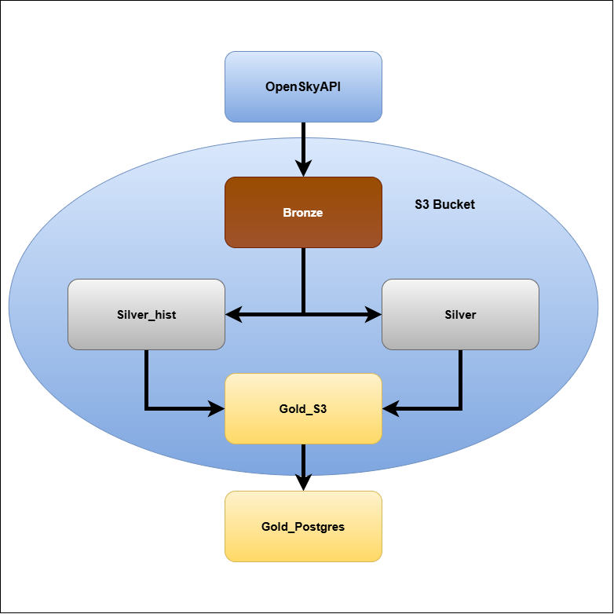
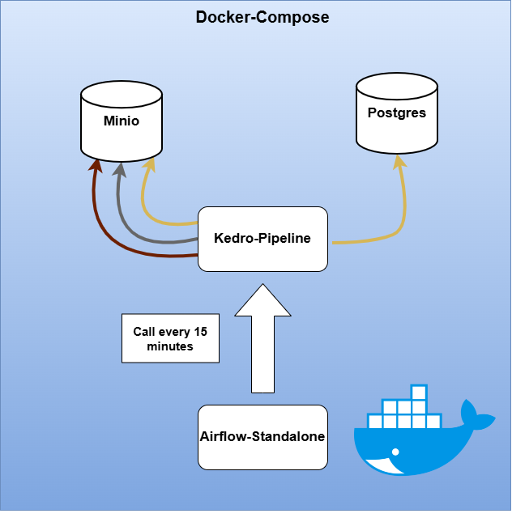

# Project goals

The purpose of this project is to visualize aircraft traffic and calculate metrics such as average velocity and altitude over Polish airspace. To achieve that goal the medallion architecture with 3 layers bronze, silver and gold was used.
Project is based on pyspark for distributed processing, s3 minio for storage, delta for acid and time travel,
kedro for organizing maintainable pipelines, airflow for orchestration and docker and docker compose for containers and in the end github actions for CI

### Technologies
| Technology | Used for|
|----------|----------|
| UV | Dependency management| 
| Pyspark | disitribiuted processing|
| Minio | On-premises S3-compatible data lake | 
| Postgres | For better access to gold layer |
| Delta-spark | ACID transactions and time travel| 
| Kedro | bulding effective pipeline| 
| Docker| contenerization services | 
| Github | version control| 

### Bronze layer:

Raw data are extracted from **[OpenSkyAPI](https://opensky-network.org/data/api)** 

Data is ingested in batch for every 15 minutes.

### Silver layer:

In silver layer data are processed for example handling with nulls in icao and callsing columns, get data from unix timestamps, convert columns to valid format and split data into category.

### Gold layer:

Data in gold layer are stored in S3 minio and mirrored to Postgres docker which can be accessed via Pg_Admin.
The gold layer follows a star schema consisting of a fact table and dimension tables.
Data are organized in Star structure with Fact_table, dimensional table and 2 separate kpi.
Fact table store information about actual flight such as flight_number,velocity,baro_altitude etc ...
Dim table store information about aircraft like number and origin country
KPI 1 – Overall flight statistics
KPI 2 – Flight statistics by vertical movement category

### Data Flow
Here is visualization of data flow:

<!--  -->
### Containers

| Service | URL / Port |
|---|---|
| PostgreSQL | http://localhost:5432 |
| MinIO API | http://localhost:9000 |
| MinIO Console | http://localhost:9001 |
| Airflow | http://localhost:8080 |
| PgAdmin | http://localhost:5050 |

## How to Run
1. Clone the repository
    git clone <repository-url>
    cd <repository-name>
2. Configure credentials

Create the following file:

    conf/local/credentials.yml

with the following structure:

    minio:
        minio_access_key: <your-minio-access-key>
        minio_secret_key: <your-minio-secret-key>
        client_kwargs:
            endpoint_url: http://minio:9000

    postgres:
        user: <your-postgres-user>
        password: <your-postgres-password>
        driver: org.postgresql.Driver
        url: jdbc:postgresql://postgres:5432/OpenSky_docker

    opensky_api:
        clientId: <your-opensky-client-id>
        clientSecret: <your-opensky-client-secret>

Important: Do not commit conf/local/credentials.yml to Git, as it contains sensitive credentials.

Log docker in dhi.io to have access to minio image using following command.
docker login dhi.io 

3. Start the application

Start all services using Docker Compose:

    docker compose up

To run the services in the background:

    docker compose up -d

The Docker Compose environment starts the services required by the data pipeline, including Spark, Airflow, MinIO and PostgreSQL.

4. Access the services

The main services can be accessed using the ports configured in docker-compose.yml.

For example:

    Service	Address
    PostgreSQL	localhost:5433
    MinIO API	localhost:9000
    MinIO Console	http://localhost:9001
    Airflow	http://localhost:8080

The exact ports depend on the mappings defined in docker-compose.yml.

5. Access PostgreSQL with PgAdmin

PostgreSQL is exposed on port 5432. It can be accessed using PgAdmin or another PostgreSQL client.

When connecting from the host machine, use:

    Host: localhost
    Port: 5433
    Database: OpenSky_docker
    Username: <your-postgres-user>
    Password: <your-postgres-password>

When connecting from another Docker container, use the PostgreSQL service name instead:

    Host: postgres
    Port: 5432
6. Stop the application

To stop the containers:

    docker compose down