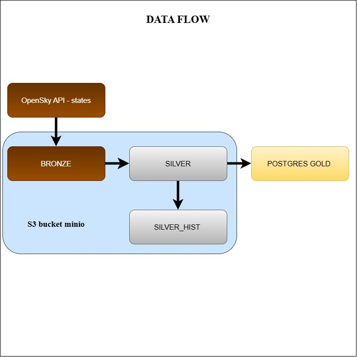

# Project goals

Project have on purpose to show aircraft traffic and metrics such as average velocity, altitude and others on Polish sky to achieve that goal the medallion architecture with 3 layers bronze, silver and gold was used.
Project is based on pyspark for distributional processing, s3 minio for storage, delta for acid and time travel,
kedro for organizing maintainable pipelines, airflow for orchestration and docker and docker compose for conteners and in the end github actions for CI

### Bronze layer:

Raw data are extracted from  
**[OpenSkyAPI](https://opensky-network.org/data/api)** 
The data are about aircraft.

### Silver layer:

In silver layer data are processed for example handling with nulls in icao and callsing columns, get data from unix timestamps, convert columns to valid format and split data into category based on example vertical_rate.

### Gold layer:

Data in gold layer are stored in S3 minio and mirrored to Postgres docker which can be accessed via Pg_Admin.
Data are organized in Star structure with Fact_table, dimensional table and 2 separate kpi.
Fact table store information about actual flight such as fly_number,velocity,baro_altitude etc ...
Dim table store information about aircraft like number and origin country
KPI number 1 are about mean statistic on every timestamp like count,velocity,altitude etc...
KPI number 2 are the same statistic but additional aggregate for every cat (descending,climbing,stable)

### Data ingestion type

Batching

### Data Flow
Here is visualalization of data flow:

<!--  -->

### Technologies
| Technology | used For|
|----------|----------|
| UV | libraries depedency| 
| Pyspark | disitribiuted processing|
| Minio | data lake - S3 bucket on prem | 
| Delta-spark | transaction and data time travel| 
| Kedro | bulding effective pipeline| 
| Docker| contenerization services | 
| Github | version control| 

