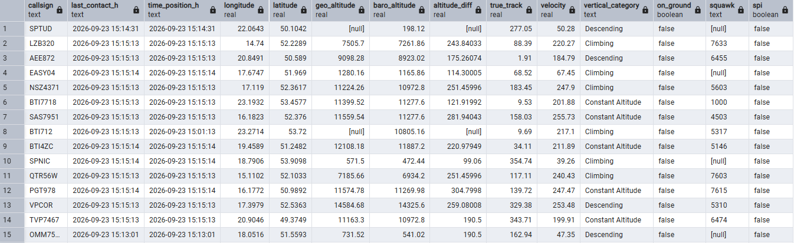
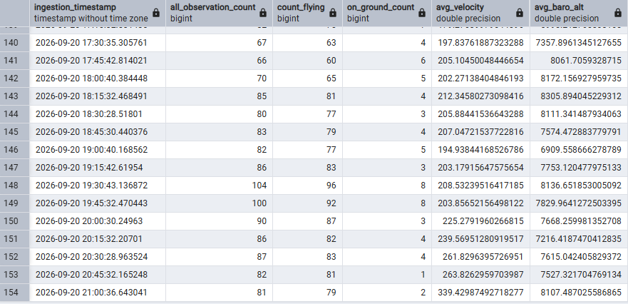
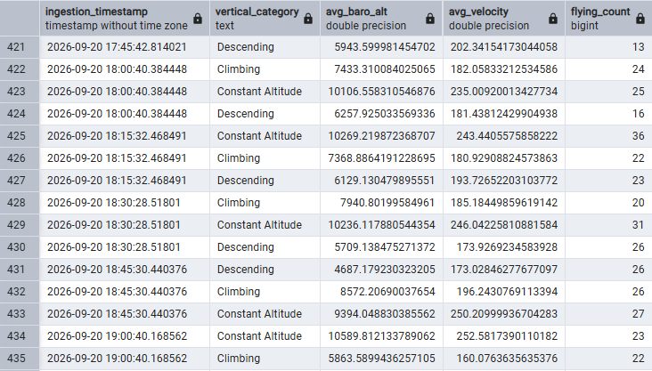
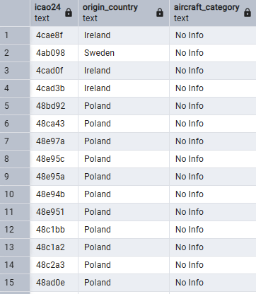

This project implements a batch data pipeline for processing aircraft data collected from the OpenSky Network API. The pipeline follows a Medallion Architecture with Bronze, Silver, and Gold layers and uses PySpark for distributed processing. Processed data is stored in MinIO using Delta Lake and the Gold layer is additionally exposed through PostgreSQL for analytical access.

# Project goals
The purpose of this project is to visualize aircraft traffic and calculate metrics such as average velocity and altitude over Polish airspace. 


# Technologies
| Technology | Used for |
|------------|----------|
| UV | Dependency management |
| PySpark | Distributed data processing |
| MinIO | On-premises S3-compatible data lake |
| PostgreSQL | Serving the Gold layer |
| Delta Lake | ACID transactions and time travel |
| Kedro | Pipeline development and organization |
| Docker | Containerization |
| GitHub | Version control and CI |

# Architecture 

## Bronze layer:

Raw data are extracted from **[OpenSkyAPI](https://opensky-network.org/data/api)** 

Data is ingested in 15-minute intervals using a batch processing approach.

## Silver layer:

In the Silver layer, raw data is cleaned and transformed. This includes handling null values in the icao24 and callsign columns, converting Unix timestamps into readable datetime values, applying appropriate data types, and categorizing flights based on their vertical rate.

## Gold layer:

Data in gold layer are stored in S3 minio and mirrored to Postgres docker which can be accessed via Pg_Admin.

The gold layer follows a star schema consisting of a fact table, dimension table and dwo separate KPI's.


Fact table store information about actual flight such as flight_number,velocity,baro_altitude etc ...

Dim table store information about aircraft like number and origin country

KPI 1 – Overall flight statistics

KPI 2 – Flight statistics by vertical movement category


## CI/tests


###  CI

```text
CI Pipeline
│
├── 1. Checkout
│      └── Download repository code
│
├── 2. Ruff
│      ├── Lint
│      └── Format
│
├── 3. Docker
│      ├── Build
│      └── Tests
│
└── 4. Result
       ├──  Success
       └──  Failure

```

### Tests 

For local test change Java_Home in tests/conftest.py file for your path of jdk-17.0.2
and run command 
    uv run pytest

```text
Project root
│
├── conf
│      ├── base
│      │    └── catalog.yml
│      ├── local 
│      │    └── credentials.yml
│      ├── ci
│      │    └── credentials.yml
│      └── logging.yml
├──  src
│      └── open_sky_pipeline
│           └── pipelines
│           │    ├── bronze
│           │    │    ├── __init__.py
│           │    │    ├── node.py
│           │    │    └── pipeline.py
│           │    ├── silver
│           │    │    ├── __init__.py
│           │    │    ├── node.py
│           │    │    └── pipeline.py
│           │    ├── gold
│           │         ├── __init__.py
│           │         ├── node.py
│           │         └── pipeline.py
│           ├── __init__.py
│           ├── hooks.py
│           ├── pipeline_registry.py
│           └── settings.py
│
└──  tests
      ├── pipelines
      │     ├── bronze
      │     │    └── pipeline.py
      │     ├── silver
      │     │    └── pipeline.py
      │     ├── gold
      │     │    └── pipeline.py
      │
      └── conftest.py
```

## Data Flow

<p align="center">

</p>


## Containers
<p align="center">

</p>


## How to Run
### 1. Clone the repository
    git clone <repository-url>
    cd <repository-name>
### 2. Configure credentials

Create the following file:

    conf/local/credentials.yml

with the following structure:

    minio:
        minio_access_key: <your-minio-access-key>
        minio_secret_key: <your-minio-secret-key>
        client_kwargs:
            endpoint_url: http://minio:9000

    postgres:
        user: <your-postgres-user>
        password: <your-postgres-password>
        driver: org.postgresql.Driver
        url: jdbc:postgresql://postgres:5432/OpenSky_docker

    opensky_api:
        clientId: <your-opensky-client-id>
        clientSecret: <your-opensky-client-secret>

Important: Do not commit conf/local/credentials.yml to Git, as it contains sensitive credentials.

Log in to the dhi.io Docker registry to access the required MinIO image:
    docker login dhi.io 

### 3. Start the application

Start all services using Docker Compose:

    docker compose up

To run the services in the background:

    docker compose up -d

The Docker Compose environment starts the services required by the data pipeline, including Spark, Airflow, MinIO and PostgreSQL.

### 4. Access the services

The main services can be accessed using the ports configured in docker-compose.yml.

For example:

| Service | URL / Port |
|---|---|
| PostgreSQL | http://localhost:5432 |
| MinIO API | http://localhost:9000 |
| MinIO Console | http://localhost:9001 |
| Airflow | http://localhost:8080 |

The exact ports depend on the mappings defined in docker-compose.yml.

### 5. Access PostgreSQL with PgAdmin

PostgreSQL is exposed on port 5432. It can be accessed using PgAdmin or another PostgreSQL client.

When connecting from the host machine, use:

    Host: localhost
    Port: 5433
    Database: OpenSky_docker
    Username: <your-postgres-user>
    Password: <your-postgres-password>

When connecting from another Docker container, use the PostgreSQL service name instead:

    Host: postgres
    Port: 5432
### 6. Stop the application

To stop the containers:

    docker compose down


# Example outputs

## Fact Table
<p align="center">

</p>


## KPI 1 – Overall flight statistics
<p align="center">

</p>

## KPI 2 – Flight statistics by vertical movement category
<p align="center">

</p>

## Dim Table
<p align="center">

</p>
